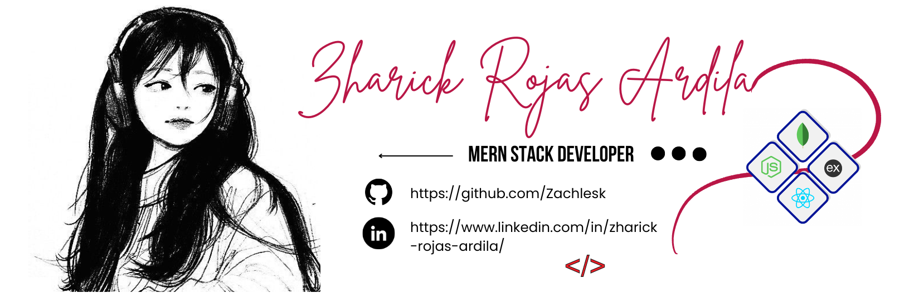

<h1 align="center"> Hey! I'm Zach 👋 </h1>

  
 

 <h2 align="center">  MERN Stack Developer ⭐  </h2>

  <h4 style="text-align: center"> 🎯 MERN Stack Developer with emphasis on Node.js, with proficency in JavaScript and package managers. </h4>
    

  <h4 style="text-align: center"> 💬 I love learning and staying on top of the latest trends in web development! I am always willing to collaborate on exciting projects and contribute my experience in creating high-quality technology solutions. </h4> 
 
  

  <h4 style="text-align: center"> 📫 Feel free to contact me to discuss collaboration opportunities or interesting projects! I am excited about the possibility of working together in the world of MERN web development. </h4> 
 

<h2 align="center"> 🚀 Skills: </h2>

- JavaScript (ES6+)
- React (Components, States, Redux)
- Node.js y Express.js
- MongoDB (Data Model, CRUD)
- HTML5 y CSS3 (Responsive web design)
- Unit and integration tests.

<h2 align="center"> 💻 Tech Stack: </h2>
    

  
  
  
  
  
  
  
  
  
  
  
  
  
  
  
  
  
  
  
  
  
  
  
  
  

 

 

<h2 align="center"> 📊 Stats: </h2>

 

---

<h2 align="center"> Connect with me </h2>

  

